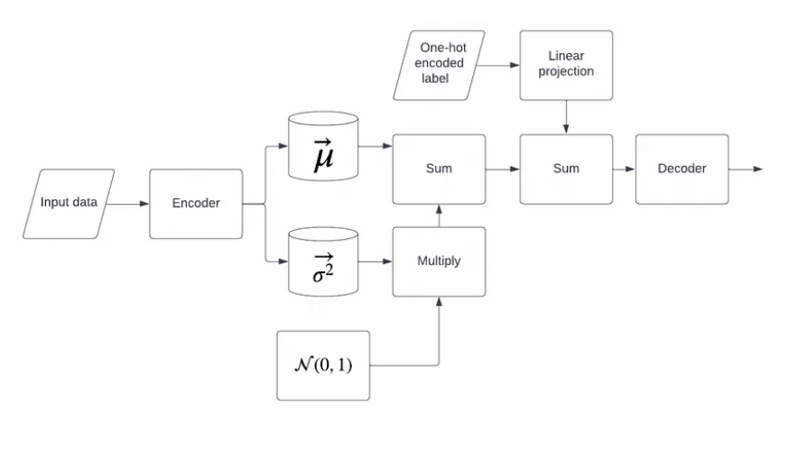
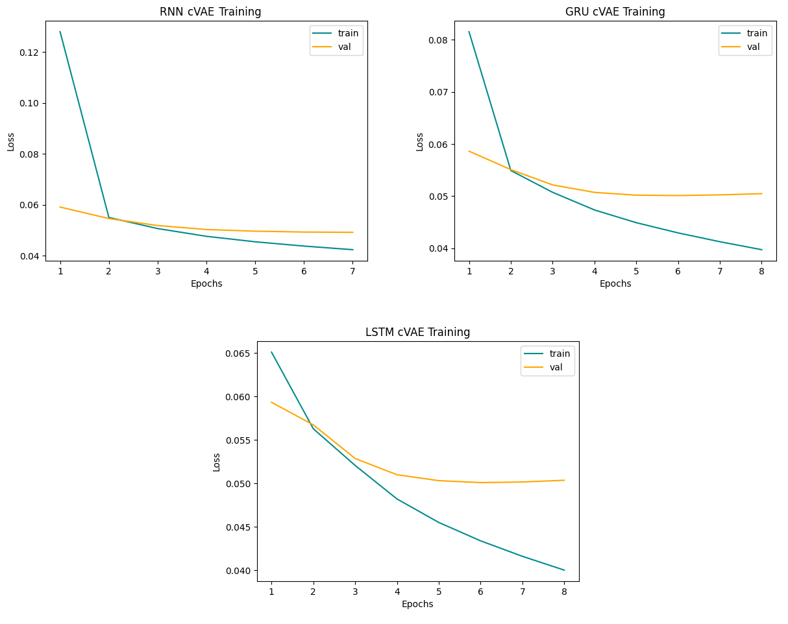

# Generating text in three italic language styles: _Dante, Italian_ and _Neapolitan_, using a cVAE based on RNNs  🖋️📖
Pytorch implementation of Text Generation.

The goal of this project is to generate text in _Dante, Italian_, and _Neapolitan_ language style, using a Conditional Variational Autoencoder where both Encoder and Decoder are Recurrent Neural Networks.
The VAE is conditioned using style labels, following the idea taken from [Medium website](https://medium.com/@sofeikov/implementing-conditional-variational-auto-encoders-cvae-from-scratch-29fcbb8cb08f):



Basically a one-hot encoded label is projected into _latent space_ dimensions and added to the latent variable in order to decode an output belonging to that style label.

During inference phase the model decodes a sentence starting from  $z \sim \mathcal{N}_{0, 1}$ + projected (given) label.


I took in consideration 3 models:
* **RNN cVAE**: both Encoder and Decoder are RNN
* **GRU cVAE**: both Encoder and Decoder are RNN with GRU units
* **LSTM cVAE**: the Encoder is a LSTM and the Decoder a GRU


The Word Embedding layer has been initialized using a Word2vec model.

The three text corpus taken in consideration for training are:
* **Dante**: _Divina Commedia_
* **Italian**: _Uno, nessuno e centomila_ by Luigi Pirandello, and _I Malavoglia_ by Giovanni Verga
* **Neapolitan**: _Lo cunto de li cunti_ by Giambattista Basile


Here's some example sentences generated by each model in three styles:

*  _**Dante**_:

_**RNN cVAE**_: _sempre là del mio a esser de la donna che a disse e l da lui che non noi non se l manco allor com io e l raccomandiamoci ciascun li di l buon si perch speran l erbette che'_ 

_**GRU cVAE**_: _le così udito ammuta autorità e poi di basso e per ch è di di e non ancora tutti s i ben come cotta questa in come e per passo co osa e io quali e i forse virgilio non_

_**LSTM cVAE**_: _del mio petto l altro lo nvidio sì ch io vidi ahi un punto di retro a sè l argine secondo che per lo cominciar in testa ma la mia coscienza ch avea natura e non altrimenti li occhi suoi_

* _**Italian**_:

_**RNN cVAE**_: _fanciul e l altra sponda non s di lui non la cinque che il di lei uva di una buona un povero una e il per fonte come l babbo non una di quella quale io il o col riso_

_**GRU cVAE**_: _tornava e a monelli quasi avete più non qua in un se la e non di di e di come da l una e il suo che gridava a mirarmi che come si anche le lo naso e a un_

_**LSTM cVAE**_: _era venuto a far quattro bicchieri i piedi che l aveva detto che piedipapera non mi sentii più di me come un altra volta non stava per via e gli altri non vi si approvano o ma se non avesse_

* _**Neapolitan**_:

_**RNN cVAE**_: _par na mio de lo spedato de copella serraje e l aseno de tre o li averene le bellezze e la perza e l aurecchie lo dava sto che a la notizia dove vuommeche le parole parole l autro e_

_**GRU cVAE**_: _trionfale le de nce a selluzzo e ceccone lo quale te na priesto spilate a lo pensiere e de sardanapalo mbrunetura era la mano grossa co riseco non vengo chisto pe nanze lloco a li granne e no lo mariuolo_

_**LSTM cVAE**_: _de lo munno e da lo re se ne scette sto piezzo e arrivato a lo quale cosa vedenno lo serpe pensiero e che non vole lo core ch è juta a la cantina e a tiempo venne lo dubbio_


# Table of Contents
- [Structure](#Structure)
- [Requirements](#Requirements)
- [Usage](#Usage)
- [Quantitative results](#Quantitative-results)
  
# Structure
* [`PRE_TRAINED_RNN_cVAE.ipynb`](PRE_TRAINED_RNN_cVAE.ipynb) is the main notebook containing pre trained models, with examples of generated text in those three styles and accuracy computations
* [`RNN_cVAE.ipynb`](RNN_cVAE.ipynb) is a notebook where all the models are defined and trained, with examples of generated text in those three styles and accuracy computations
* [`models.py`](models.py) is the module containing model class definitions
* [`config_dataset.py`](config_dataset.py) is the module containing the functions for making the dataset in form of torch Dataloaders
* [`training_function.py`](training_function.py) is the module containing the training function for the three models and for the CNN Classifier
* [`accuracy.py`](accuracy.py) is the module containing the accuracy function
* [`text_corpus`](text_corpus) repository contains the three corpus used for training
* [`pretrained`](pretrained) repository contains pre-trained models
  
# Requirements
* Numpy
* Matplotlib
* Pytorch
* Gensim

# Usage
First clone the repository:

```bash
git clone git@github.com:MassimoMario/Italic_Text_Style_Classification.git
```

Make sure to have Pytorch and Gensim installed:
```bash
pip install torch
```

```bash
pip install gensim
```

Run cells from [`RNN_cVAE.ipynb`](RNN_cVAE.ipynb) notebook if you want to train the models yourself, or run [`PRE_TRAINED_RNN_cVAE.ipynb`](PRE_TRAINED_RNN_cVAE.ipynb) to use pre-trained models. Both notebooks have sentence generation examples and accuracy computation after every model definition.

# Quantitative results


To quantify the accuracy in generating sentence with a given style, an independent CNN Classifier has been trained to detect the generated style from the models.

The **SA**, Style Accuracy, and **PPL** $= 2^{- \frac{1}{N} \sum_i log_2 \left( P(w_i)\right)}$, Perplexity, are here reported for the three models:

| Model | # Parameters | SA | Average PPL |
| --- | --- | --- | --- |
| RNN cVAE | 3648159 | 91.96 % | 37.41 | 
| GRU cVAE | 4000415 | 96.00 % | 23.43 | 
| LSTM cVAE | 4088479 | 99.43 % | 37.53 | 


Here's the training curves for the three models:



